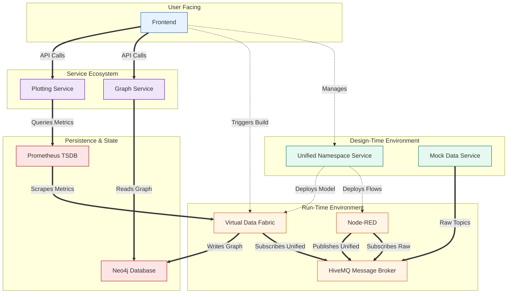

# System Architecture

This document provides a detailed overview of the system's architecture, its core principles, and the flow of data and control between its microservices. The platform is designed as a cohesive data unification and contextualization pipeline, transforming raw, device-centric IoT data into a queryable, real-time digital twin of a physical environment.

## High-Level Architectural Model

The architecture is fundamentally divided into two distinct logical areas: the **Design-Time Environment** and the **Run-Time Environment**. This separation is the core pattern of the system, allowing users to model and configure their data pipeline declaratively before deploying it into a live, operational state.

- **The Design-Time Environment** is where the user defines the _what_ and _how_. It is the control plane for mapping raw data sources to a semantic model of a physical space.
- **The Run-Time Environment** is where the plan is _executed_. It is the data plane that processes the live data streams according to the user's deployed configuration.

### System Diagram

The following diagram illustrates the services, their interactions, and the flow of data and control.

## Architectural Principles

The system is built upon several key engineering principles:

- **Event-Driven & Decoupled:** Services communicate asynchronously through a central message broker (`HiveMQ`). This pub/sub model ensures that producers and consumers are decoupled, allowing services to be scaled, updated, or replaced independently.
- **Separation of Concerns:** Each microservice has a single, well-defined responsibility. For example, the `VDF` handles run-time data ingestion, while the `graph-service` is solely responsible for exposing the graph via an API.
- **Backend-for-Frontend (BFF):** The `graph-service` and `plotting-service` act as specialized backends for the frontend. They abstract the complexities of the underlying databases (`Neo4j`, `Prometheus`) and provide data in a format that is optimized for UI consumption.
- **Ephemeral State & Configuration as Code:** The run-time environment is treated as ephemeral. The entire state of the system—the Node-RED flows, the Neo4j graph—can be torn down and rebuilt from scratch based on the configuration defined in the UNS. This makes the system resilient, reproducible, and easy to manage.

## Component Breakdown

### 1. The Design-Time Environment

This is the system's "control plane."

- **[Frontend](components/frontend.md):** The user's command center. It is a pure client-side application that orchestrates the entire configuration workflow by communicating with the various backend APIs.
- **[Unified Namespace Service (UNS)](components/unified-namespace.md):** The "brain" of the design phase. It's a stateful service that maintains the master list of `Things` and the hierarchical `Building` model. Its primary role is to act as a **compiler**, translating the user's declarative model into executable artifacts (Node-RED flows) and the final run-time blueprint for the VDF.

### 2. The Run-Time Environment

This is the system's "data plane," responsible for executing the deployed pipeline.

- **[Message Broker (HiveMQ)](components/message-broker.md):** The central nervous system. It is a high-performance MQTT broker that acts as the data bus for all real-time event streams, both raw and unified.
- **[Node-RED](components/node-red.md):** The **data transformation engine**. It executes the flows generated by the UNS. Its sole job is to subscribe to the raw, device-centric topics, perform any user-injected script logic, and republish the messages onto the new, semantically structured topics of the Unified Namespace.
- **[Virtual Data Fabric (VDF)](components/virtual-data-fabric.md):** The **run-time orchestrator**. It is a state machine that is activated by the UNS. Once built, it subscribes to all topics in the Unified Namespace and fans the data out to the appropriate persistence layers and real-time clients. It is the bridge between the live data stream and the historical/structural data stores.

### 3. The Persistence & Query Layer

This layer provides the long-term memory and query capabilities of the system.

- **[Neo4j](components/neo4j.md):** The **knowledge graph database**. It stores the structural model of the system—the relationships between buildings, floors, rooms, and things. It does _not_ store time-series data.
- **[Prometheus](components/prometheus.md):** The **time-series database (TSDB)**. It actively scrapes a metrics endpoint on the VDF, storing all numeric sensor data with rich, queryable labels. This is the engine that powers all historical plotting.

### 4. The Service Ecosystem (BFFs)

This is a layer of specialized microservices that serve data to the frontend.

- **[Graph Service](components/service-ecosystem/graph-service.md):** The dedicated API for the Neo4j database. It translates frontend requests into Cypher queries and formats the output into a JSON structure optimized for graph visualization.
- **[Plotting Service](components/service-ecosystem/plotting-service.md):** The dedicated API for the Prometheus database. It translates frontend requests (e.g., "get data for this room") into precise PromQL queries and returns simplified JSON data ready for plotting.

## Detailed System Flows

### Data Flow (A Single Message's Journey)

1.  A sensor (simulated by the **[Mock Data](components/mock-data.md)** service) publishes a message with a device-centric topic (e.g., `HumiditySensorConferenceRoom/events/humidity`) to `HiveMQ`.
2.  A `Node-RED` flow, which is subscribed to that specific topic, receives the message.
3.  The flow processes the message (and runs any custom scripts) and republishes it to `HiveMQ` on a new, unified topic (e.g., `my_smart_office/floor_1/conference_room/humidity`).
4.  The `VDF`, which is subscribed to all unified topics, receives the new message.
5.  The `VDF` immediately broadcasts the message via its **WebSocket** server.
6.  The `VDF` updates its internal state, which is exposed on its `/metrics` endpoint.
7.  At the next scrape interval, `Prometheus` pulls this new data point from the VDF's `/metrics` endpoint and stores it.

### Control Flow (Deploying a New Configuration)

1.  A user interacts with the **Frontend**, first registering Things and then arranging them in the "Building Structure" tab. This configuration is saved to the **UNS**.
2.  On the "Node Red Management" tab, the user clicks "Generate." The **Frontend** tells the **UNS** to compile and deploy the flows to the `Node-RED` instance.
3.  The user then clicks "Export to Virtual Data Fabric." The **Frontend** tells the **UNS** to generate the final run-time model and send it to the **VDF**.
4.  On the "Virtual Data Fabric" tab, the user clicks "Build." The **Frontend** sends a command directly to the **VDF**.
5.  The **VDF**, now possessing the configuration from the UNS, executes its build process: it connects to `Neo4j` to populate the graph and connects to `HiveMQ` to subscribe to the unified topics. The system is now fully live.
