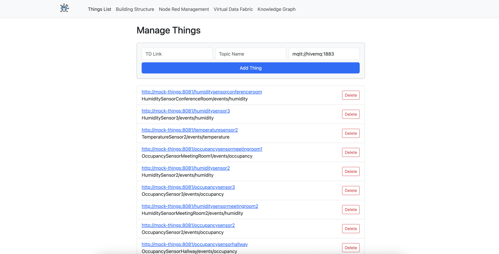

# Frontend

The **Frontend** is the central command and control center for the entire platform. It is a sophisticated single-page application (SPA) that provides a comprehensive user interface for the two primary phases of the system's lifecycle: **design-time configuration** and **run-time monitoring**.

It acts as a pure client, abstracting away the complexity of the distributed backend. The user interacts with a single, cohesive application, while the frontend orchestrates the entire workflow by communicating exclusively with its dedicated backend services: the **[Unified Namespace Service (UNS)](components/unified-namespace.md)**, the **[Graph Service](components/service-ecosystem/graph-service.md)**, and the **[Plotting Service](components/service-ecosystem/plotting-service.md)**.

## Key Technologies

The frontend is built on a modern, robust technology stack to deliver a responsive and interactive user experience.

- **Framework:** **Angular**, providing a powerful component-based structure for the application.
- **UI & Styling:** **Bootstrap** and **NG-Bootstrap** are used to create a clean, professional, and responsive layout that works well across different screen sizes.
- **Graph Visualization:** **`@swimlane/ngx-graph`**, a feature-rich library that renders the knowledge graph, allowing users to interactively pan, zoom, and drag nodes to explore the system's structure.
- **Data Plotting:** **`Chart.js`** (via the `ng2-charts` wrapper) is used to generate the smooth, live-updating time-series plots of sensor data, providing immediate visual feedback on the system's state.

## The User Workflow: From Design to Monitoring

The application is organized into a series of tabs in the top navigation bar, guiding the user through a logical five-step process to configure, deploy, and visualize their IoT system. This step-by-step journey is the core experience of the platform.

### Step 1: Managing Things (`Things List` Tab)

This is the foundational step of the entire configuration process. This view is a management interface for registering all the raw data sources—the "Things"—that the system will eventually process. Rather than relying on automatic discovery, this tab gives the user explicit control over the system's inputs.

- **Functionality:** Users manually add each "Thing" by providing its **Thing Description (TD) Link**, its unique raw **Topic Name**, and the address of the message broker where it publishes data. The list below the form displays all currently registered Things, which can be deleted at any time.
- **Backend Interaction:** This view communicates directly with the **[Unified Namespace Service (UNS)](components/unified-namespace.md)**. Every "Add" or "Delete" action immediately updates the master `things.json` list on the UNS server.

### Step 2: Building the Model (`Building Structure` Tab)

Once the raw "Things" are registered, this tab allows the user to give them semantic context. It is a powerful and intuitive visual editor for creating the hierarchical model of the physical environment, which is the core concept of the Unified Namespace.

- **Functionality:** Users can define a building, add new floors to it, and add new rooms to each floor. Within each room's card, users can then assign the "Things" they registered in the previous step from a convenient, auto-completing dropdown list. This action directly maps a raw data stream to a physical location.
- **Backend Interaction:** After arranging the hierarchy and assigning all the Things, the user saves the structure. This action sends the entire model to the **UNS**, where it is persisted as the `building.json` file.

### Step 3: Generating and Customizing Flows (`Node Red Management` Tab)

This tab is the "compiler" that transforms the abstract building model into executable logic.

- **Functionality:** Initially, the page displays a single "Generate Node-RED" button. Clicking this instructs the UNS to create and deploy the data transformation flows to the **[Node-RED](components/node-red.md)** instance. Once generated, this view becomes a detailed dashboard showing a card for each active flow.
- **Advanced Customization:** For each flow, users can click "Edit Node-RED Workflow" to inject custom JavaScript for on-the-fly debugging or data manipulation, all managed via a simple modal dialog. This allows for powerful, targeted modifications without ever leaving the main application.
- **Backend Interaction:** This view interacts heavily with the **UNS**'s flow generation and custom script endpoints.

### Step 4: Deploying the Runtime (`Virtual Data Fabric` Tab)

This is the final deployment step, activating the run-time half of the system and bringing the data to life.

- **Functionality:** The deployment is a two-click process. First, on the "Node Red Management" tab, the user clicks **"Export to Virtual Data Fabric."** This primes the **[VDF](components/virtual-data-fabric.md)** with the final configuration. Then, on this tab, the user clicks the final **"Build Virtual Data Fabric"** button. This triggers the VDF to create the Neo4j graph and activate all its data listeners.
- **System Status:** Once built, this page transforms into a run-time control panel, showing the deployment status and providing convenient links to external tools like Grafana and the Neo4j Console. User actions are confirmed with clear toast notifications.

### Step 5: Visualizing the Live System (`Knowledge Graph` Tab)

This is the primary monitoring interface and the payoff for the entire setup process. It provides a powerful, interactive, and holistic view of the live system, seamlessly blending structural context with real-time data.

- **Functionality:** The view is split into two panels. On the left, a complete, interactive visualization of the knowledge graph is rendered using `ngx-graph`. On the right, a panel initially prompts the user to select a node.
- **Interactive Plotting:** When a user clicks on any node in the graph (e.g., a "Room," a "Floor," or even a "ThingType"), the frontend instantly queries the **[Plotting Service](components/service-ecosystem/plotting-service.md)**. The right-hand panel is then populated with live-updating `Chart.js` charts showing all the relevant sensor data for the selected entity.
- **Backend Interaction:** This view demonstrates the power of the service ecosystem, relying on both the **[Graph Service](components/service-ecosystem/graph-service.md)** (to render the graph) and the **[Plotting Service](components/service-ecosystem/plotting-service.md)** (to fetch the data for the plots).

---

## System Dependencies and Architecture

The frontend is architected as a pure client application, which ensures a clean separation of concerns and enhances system modularity.

!> **Backend-for-Frontend (BFF) Architecture:** The frontend **never** communicates directly with databases (`Neo4j`, `Prometheus`) or core infrastructure (`HiveMQ`, `Node-RED`). It relies exclusively on its three dedicated backend services to act as intermediaries. For the frontend to be fully functional, `uns`, `graph-service`, and `plotting-service` must be running and healthy.

---

## For Developers

### Docker Build and Runtime

The frontend is a production-ready Angular application served by a lightweight web server inside a Docker container.

- **Build Process:** The `Dockerfile` uses a **multi-stage build** for optimization and security. In the `build-stage`, a full Node.js environment is used to install dependencies and compile the Angular application (`npm run build --prod`). In the `production-stage`, only the resulting static files (from the `/dist/frontend/` folder) are copied into a minimal `nginx:stable-alpine` image. This creates a small, secure, and efficient final container.
- **Web Server Configuration:** A custom `nginx.conf` file is used to configure the Nginx web server, typically to handle SPA routing by redirecting all paths to `index.html`.
- **Port Mapping:** The `docker-compose.yml` file maps port `4200` on the host to port `80` inside the container, which is the standard HTTP port the Nginx server listens on.
